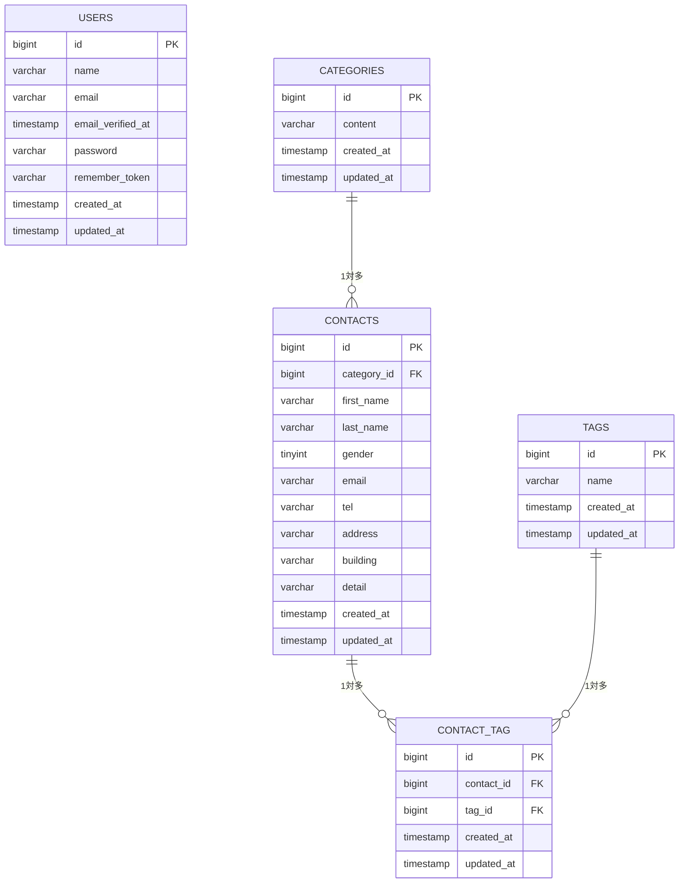

# CoachTech お問い合わせフォーム

## 概要

CoachTech確認テスト用のお問い合わせフォームアプリケーションです。

お問い合わせの入力・確認・送信機能に加え、認証機能、管理画面でのお問い合わせ検索・詳細確認・削除、タグ管理、REST APIを実装しています。

## 使用技術

- PHP 8.x
- Laravel 10.x
- MySQL 8.x
- Docker
- Laravel Sail
- phpMyAdmin
- Composer
- Node.js
- npm
- Vite
- Tailwind CSS 3.4.x
- Git
- GitHub

## 環境構築

### 1. リポジトリをクローン

```bash
git clone <リポジトリURL>
```

```bash
cd contact-form-app
```

### 2. 環境変数ファイルを作成

```bash
cp .env.example .env
```

### 3. Composerパッケージをインストール

```bash
composer install
```

### 4. Dockerコンテナを起動

```bash
./vendor/bin/sail up -d
```

### 5. アプリケーションキーを生成

```bash
./vendor/bin/sail artisan key:generate
```

### 6. npmパッケージをインストール

```bash
./vendor/bin/sail npm install
```

### 7. マイグレーション・シーディングを実行

```bash
./vendor/bin/sail artisan migrate:fresh --seed
```

### 8. Viteを起動

```bash
./vendor/bin/sail npm run dev
```

## 実装機能

### お問い合わせフォーム

- お問い合わせ入力
- バリデーション
- 確認画面
- お問い合わせ送信
- サンクスページ表示
- カテゴリ選択
- タグ選択

- お問い合わせフォーム
    - 入力
    - 確認
    - 送信
    - サンクスページ表示

- 認証機能
    - 会員登録
    - ログイン
    - ログアウト

- 管理画面
    - お問い合わせ一覧表示
    - 名前・メールアドレス検索
    - 性別検索
    - お問い合わせ種類検索
    - 日付検索
    - ページネーション
    - お問い合わせ詳細表示
    - お問い合わせ削除

- タグ管理
    - タグ一覧表示
    - タグ追加
    - タグ編集
    - タグ削除

    ### API

- お問い合わせ一覧取得API（GET）
- お問い合わせ詳細取得API（GET）
- お問い合わせ登録API（POST）
- お問い合わせ更新API（PUT）
- お問い合わせ削除API（DELETE）
- API Resourceによるレスポンス整形
- FormRequestによるバリデーション

### 環境構築

### 認証機能

- 会員登録
- ログイン
- ログアウト

### 管理画面

- お問い合わせ一覧表示
- キーワード検索
- 性別検索
- お問い合わせ種類検索
- 日付検索
- タグ検索
- ページネーション
- お問い合わせ詳細表示
- お問い合わせ削除

### タグ管理

- タグ一覧表示
- タグ追加
- タグ編集
- タグ削除

### API

- お問い合わせ一覧取得
- お問い合わせ詳細取得
- お問い合わせ登録
- お問い合わせ更新
- お問い合わせ削除
- キーワード検索
- 性別検索
- カテゴリ検索
- 日付検索
- API Resourceによるレスポンス整形
- FormRequestによるバリデーション

## APIエンドポイント

| メソッド  | エンドポイント               | 内容                 |
| --------- | ---------------------------- | -------------------- |
| GET       | `/api/v1/contacts`           | お問い合わせ一覧取得 |
| GET       | `/api/v1/contacts/{contact}` | お問い合わせ詳細取得 |
| POST      | `/api/v1/contacts`           | お問い合わせ登録     |
| PUT/PATCH | `/api/v1/contacts/{contact}` | お問い合わせ更新     |
| DELETE    | `/api/v1/contacts/{contact}` | お問い合わせ削除     |

## テーブル構成

- users
- categories
- contacts
- tags
- contact_tag

## ER図



## モデル・リレーション

- Category：Contact（1対多）
- Contact：Category（多対1）
- Contact：Tag（多対多）
- Tag：Contact（多対多）

## シーディング

以下のSeederを使用して初期データを登録します。

- UserSeeder
- CategorySeeder
- TagSeeder
- ContactSeeder

```bash
./vendor/bin/sail artisan migrate:fresh --seed
```

## テスト

FeatureテストおよびAPIテストを実装しています。

```bash
./vendor/bin/sail artisan test
```

カバレッジを確認する場合：

```bash
./vendor/bin/sail artisan test --coverage
```

テストカバレッジ：約73%

## 開発環境

- Laravel：http://localhost
- phpMyAdmin：http://localhost:8080

## 作成者

南　雄大
