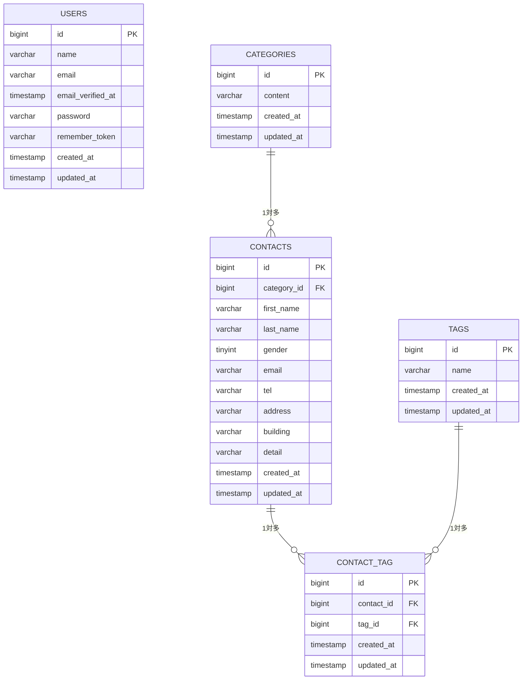

# CoachTech お問い合わせフォーム

## 概要

CoachTech確認テスト用のお問い合わせフォームアプリケーションです。
Laravel 10を用いたWebアプリケーション開発環境を構築し、Docker（Laravel Sail）上で動作する開発環境を作成しました。
今後、この環境を基盤としてお問い合わせフォーム機能を実装します。

## 使用技術

- OS：macOS
- PHP 8.2
- Laravel 10.x
- MySQL 8.0
- Docker
- Laravel Sail
- Nginx
- phpMyAdmin
- Composer
- Node.js
- npm
- Vite
- Tailwind CSS 3.4.0
- Git
- GitHub

## 環境構築

以下の手順で開発環境を構築しました。

1. Laravel 10プロジェクトを作成
2. Laravel Sailを導入
3. Dockerコンテナを作成・起動
4. npm依存パッケージをインストール
5. Tailwind CSS・Viteを設定
6. 提供されたresourcesディレクトリへ差し替え
7. phpMyAdminをDockerへ追加
8. Sailを再起動しエイリアスを設定
9. アプリケーションキーを生成
10. データベース接続を確認
11. Laravel・phpMyAdminの動作確認
12. マイグレーションを実行
13. Gitでバージョン管理を開始
14. GitHubリポジトリを作成
15. GitHub Issueを作成し、Issue駆動で開発を開始

## Git運用

本プロジェクトではGitHubを利用し、Issue駆動で開発を行います。

- GitHubリポジトリ作成
- Issue作成
- 機能ごとにブランチを作成
- コミット
- Push
- Pull Request
- mainブランチへマージ

## 実装機能

### シーディング

- UserSeeder
    - usersテーブルに初期管理者を1件登録
    - 名前：Test User
    - メールアドレス：test@example.com
    - パスワード：password（Hash::make()でハッシュ化）
    - フロント画面からログイン可能

- CategorySeeder
    - categoriesテーブルにお問い合わせカテゴリを5件登録
        - 商品のお届けについて
        - 商品の交換について
        - 商品トラブル
        - ショップへのお問い合わせ
        - その他

- TagSeeder
    - tagsテーブルにタグを5件登録
        - 質問
        - 要望
        - 不具合報告
        - ご意見
        - その他

- ContactFactory
    - Faker（ja_JP）を使用してフォーム入力に近いダミーデータを生成
    - 氏名、性別、メールアドレス、電話番号、住所、建物名、お問い合わせ内容を生成

- ContactSeeder
    - contactsテーブルに20件のダミーデータを登録
    - category_idはcategoriesテーブルからランダムに設定
    - 各Contactに対してtagsテーブルからランダムに1〜3件のタグを紐付け（attach）

- DatabaseSeeder
    - UserSeeder
    - CategorySeeder
    - TagSeeder
    - ContactSeeder
      を順番に実行し、一括で初期データを投入できるように実装

#### 動作確認

```bash
sail artisan migrate:fresh --seed
```

- 全Seederが正常に実行されることを確認
- usersテーブルに管理ユーザーが1件登録されることを確認
- categoriesテーブルに5件登録されることを確認
- tagsテーブルに5件登録されることを確認
- contactsテーブルに20件登録されることを確認
- contact_tagテーブルに1〜3件ずつタグが紐付いていることを確認

## 実装済み機能

- お問い合わせ入力
- バリデーション
- 確認画面
- お問い合わせ送信
- サンクスページ

- お問い合わせフォーム
    - 入力
    - 確認
    - 送信
    - サンクスページ表示

- 認証機能
    - 会員登録
    - ログイン
    - ログアウト

- 管理画面
    - お問い合わせ一覧表示
    - 名前・メールアドレス検索
    - 性別検索
    - お問い合わせ種類検索
    - 日付検索
    - ページネーション
    - お問い合わせ詳細表示
    - お問い合わせ削除

- タグ管理
    - タグ一覧表示
    - タグ追加
    - タグ編集
    - タグ削除

### 環境構築

- Laravel 10開発環境構築
- Docker（Laravel Sail）環境構築
- MySQL接続
- phpMyAdmin導入
- Tailwind CSS設定
- Vite設定
- Git管理
- GitHub連携

### テーブル設計・マイグレーション

- usersテーブルを作成
- categoriesテーブルを作成
- contactsテーブルを作成
- tagsテーブルを作成
- contact_tag中間テーブルを作成
- 外部キー制約を設定
- ON DELETE CASCADEを設定
- contact_tagに複合ユニークキーを設定
- マイグレーションを実行

## ER図



### モデル・リレーション

- Categoryモデルを作成
- Contactモデルを作成
- Tagモデルを作成
- Category：Contact（1対多）リレーションを設定
- Contact：Category（多対1）リレーションを設定
- Contact：Tag（多対多）リレーションを設定
- Tag：Contact（多対多）リレーションを設定
- 各モデルにfillableプロパティを設定

## 開発環境

Laravel http://localhost
phpMyAdmin http://localhost:8080
